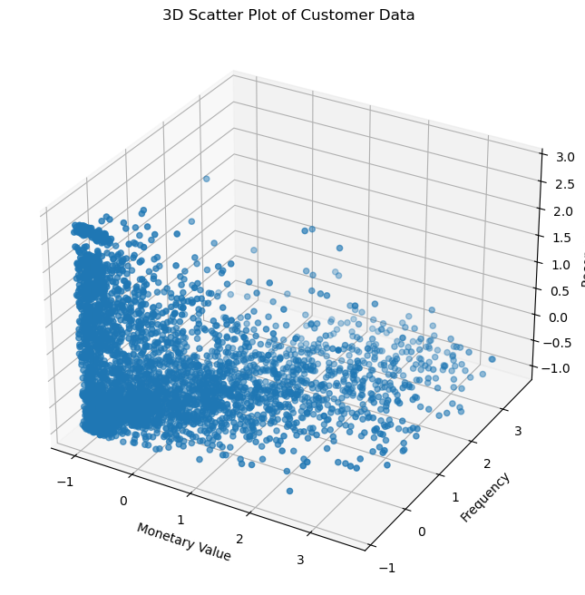
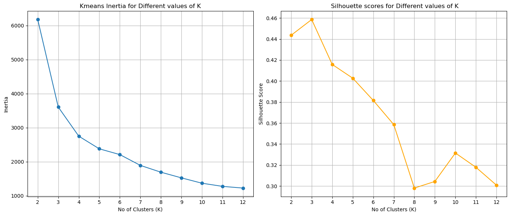
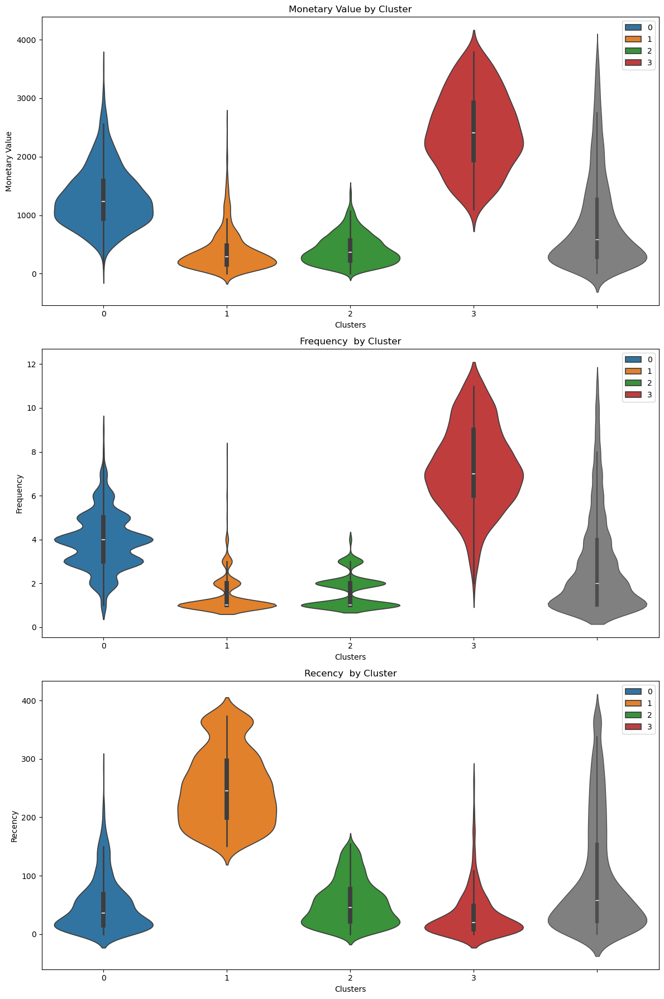
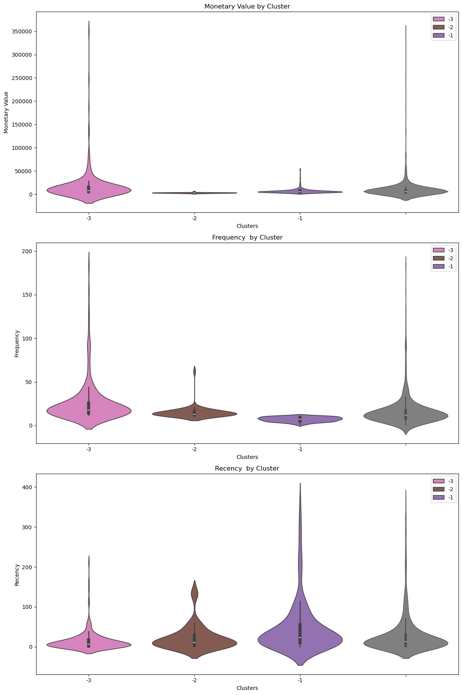
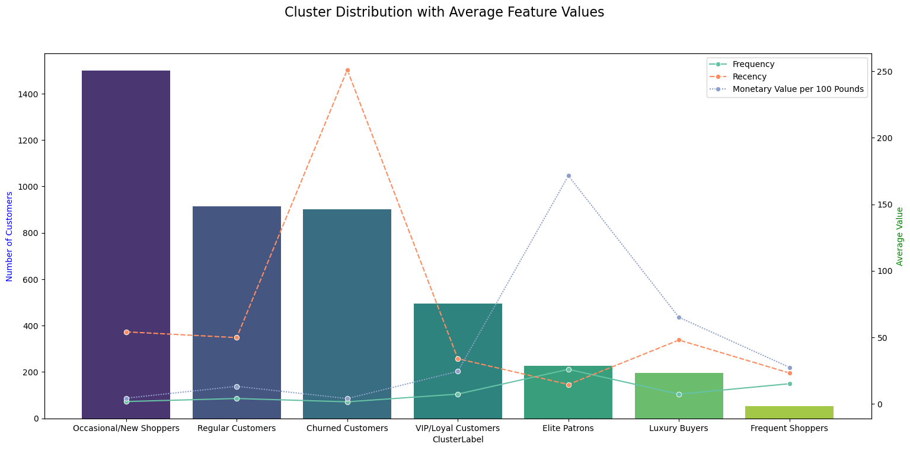

# 🛒 Customer Segmentation Using K-Means Clustering  

## 📌 Overview  
This project applies **K-Means clustering** to segment customers based on their purchasing behavior using **Recency, Frequency, and Monetary (RFM) analysis**. The dataset consists of **541,911 transactions**, which were cleaned and analyzed to group customers into meaningful clusters.

---

## 🚀 Key Features  
✔ **Data Cleaning & Preprocessing:** Removed missing values and retained **406,309 transactions (77%)** for analysis.  
✔ **Feature Engineering:** Engineered RFM features to represent customer purchasing behavior.  
✔ **Clustering Approach:** Applied **K-Means** and determined optimal clusters using the **Elbow method & Silhouette score**.  
✔ **Outlier Handling:** Segmented **non-outliers (4 clusters)** and **outliers (3 clusters)** separately.  
✔ **Visualization:** Explored clusters using **3D scatter plots, violin plots, and box plots** for insights.  

---

## 🔍 1️⃣ Data Preprocessing & Standardization  
To ensure meaningful clustering, we applied **standard scaling** to normalize features.  

### 📌 3D Scatter Plot After Standard Scaling  
After scaling, the data distribution was visualized in 3D to analyze customer groupings.  

  

---

## 🔢 2️⃣ Determining Optimal Clusters  
To find the optimal number of clusters, we used:  
- **Elbow Method** 📉 - Measures inertia to detect the "elbow" point.  
- **Silhouette Score** 📊 - Evaluates cluster cohesion and separation.  

### 📌 Elbow & Silhouette Scores  
  

Based on these methods, we selected **4 clusters for non-outliers** and **3 clusters for outliers** separately.

---

## 📊 3️⃣ Clustering & Customer Segmentation  
After applying **K-Means**, customers were segmented into distinct behavioral groups.  

### 📌 Violin Plots for RFM Analysis  
The violin plots below illustrate how different customer clusters vary in terms of **monetary value, frequency, and recency**.  

**📍 Non-Outlier Clusters**  
  

**📍 Outlier Clusters**  
  

Each cluster represents a specific type of customer, helping businesses **identify high-value customers, churn risks, and frequent shoppers**.  

---

## 📌 4️⃣ Final Customer Segments & Insights  
Using the refined clusters, we categorized customers into **six distinct groups** based on purchasing behavior.  

### 📌 Cluster Distribution with Average Feature Values  
  

### 🔹 Key Takeaways:  
✔ **VIP Customers & Frequent Buyers** → High-value customers for loyalty programs.  
✔ **Occasional Shoppers & Churned Customers** → Require engagement strategies.  
✔ **Luxury Buyers & Elite Patrons** → Premium customers with high spending patterns.  

---

## 🎯 Business Applications  
💡 **Targeted Marketing** – Personalized promotions based on customer segments.  
💡 **Customer Retention** – Proactive engagement for at-risk customers.  
💡 **Product Recommendations** – Optimized cross-selling and upselling.  

---

## 🛠 Technologies Used  
🔹 **Python (Pandas, NumPy, Scikit-learn, Matplotlib, Seaborn)**  
🔹 **Jupyter Notebook for Data Analysis**  
🔹 **K-Means Clustering for Segmentation**  

---

## 📂 Project Structure  
